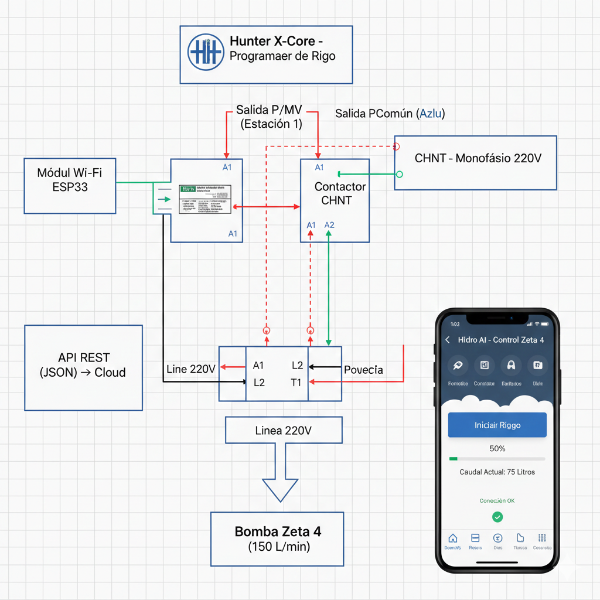

# Hidro AI - NextGenAI Agency
Sistema inteligente de monitoreo hídrico con IA, integrado con Hunter X-Core y PostgreSQL, diseñado para la gestión eficiente y escalabilidad de recursos mediante Python.

## Tecnologías
* Python (Flask API)
* PostgreSQL (Base de datos industrial)
* Integración con Hunter X-Core y Sonoff

## Estado del Proyecto
- [x] Estructura de base de datos creada
- [x] Backend validado con Mock Tests